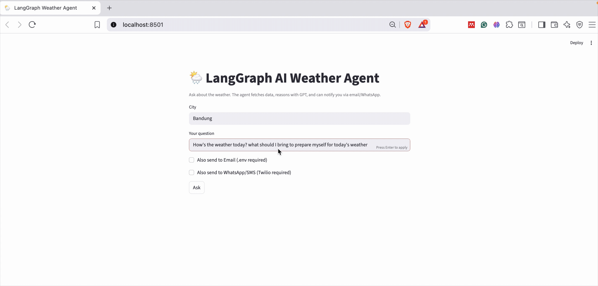
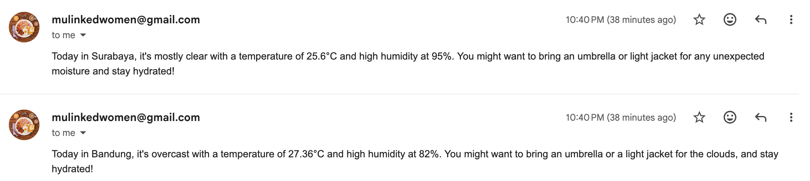
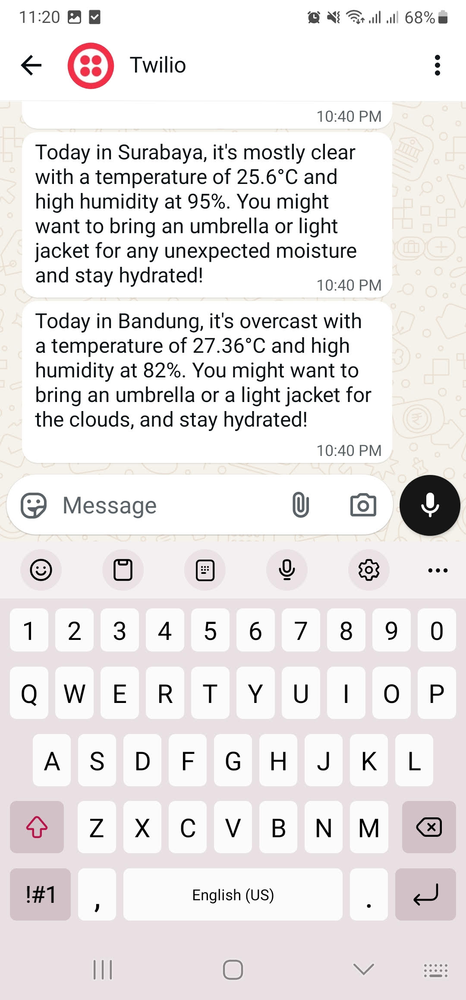
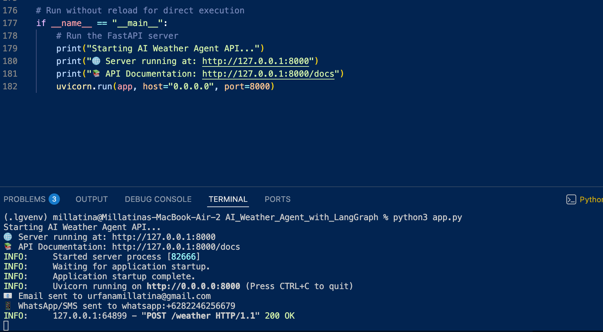
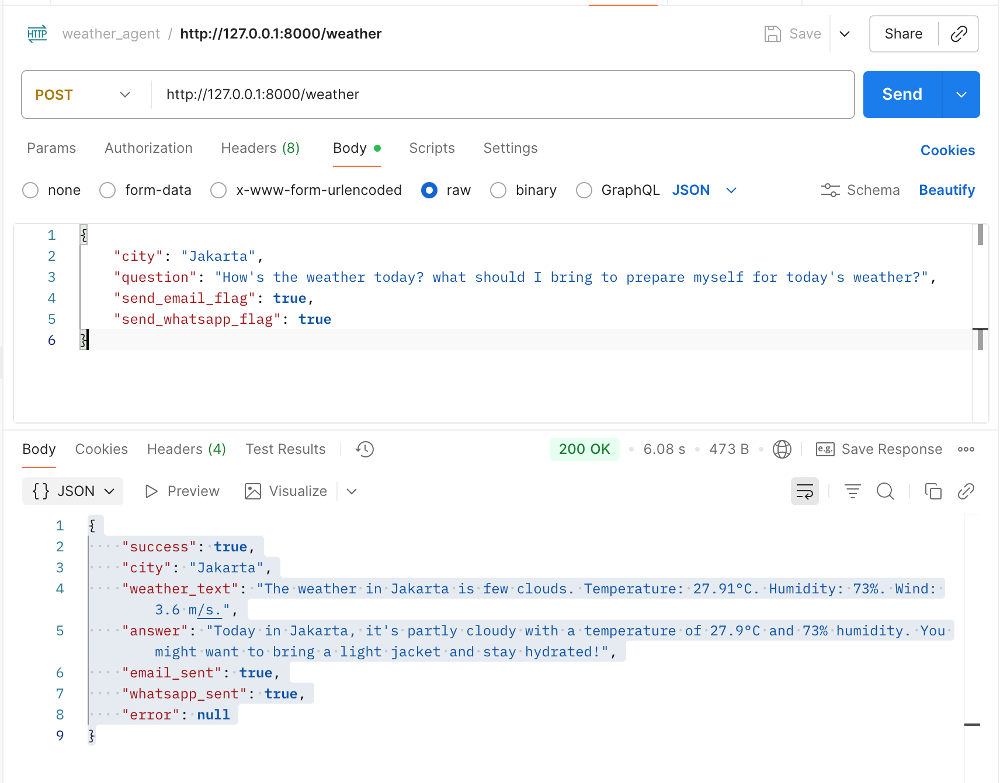
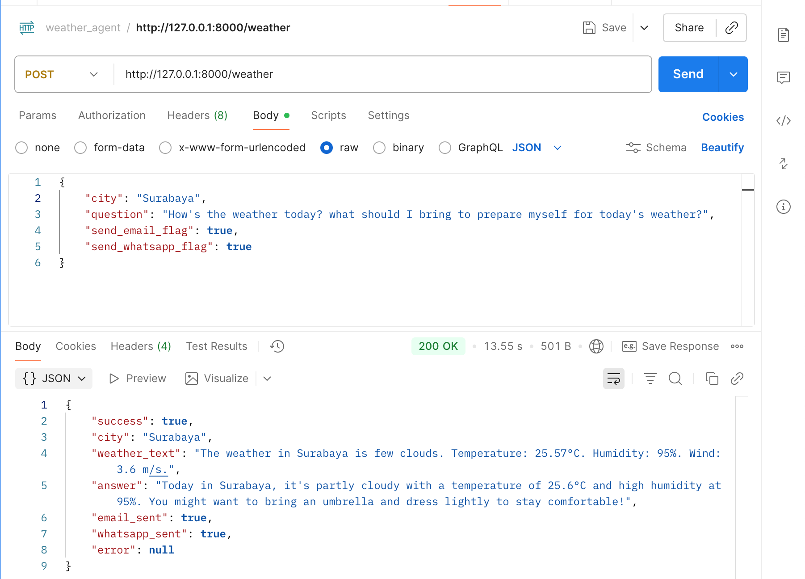
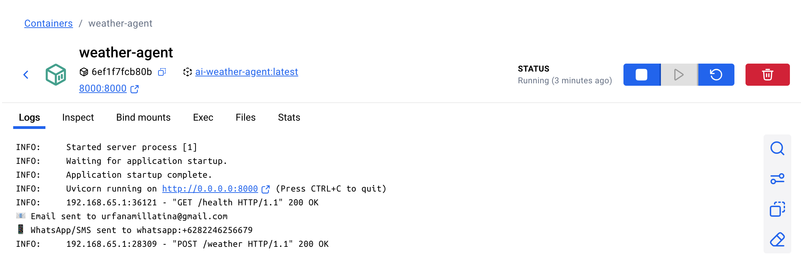

<p align="center">
<h1 align="center">AI Weather Agent with LangGraph
</h1>
</p>

<p align="center">
    
    
    
    
    
    
    
    
    
</p>

<p align="center">
  <br/>
  <em>Demo: AI Weather Agent with LangGraph </em>
</p>


<p align="center">
<h3 align = "center"> Notification Outputs
</h3>
</p>

<p align="center">
  <br/>
  <em>Email Notifications </em>
</p>

<p align="center">
  <br/>
  <em>Whatsapp Notifications </em>
</p>

## 🌤️ AI Weather Agent with LangGraph

AI weather agent that combines real-time weather data with AI-powered reasoning using LangGraph state machines. This agent provides personalized weather insights and delivers notifications through multiple channels via Streamlit web interface, RESTful API, and CLI.

## 📋 What's this model about?

The **AI Weather Agent with LangGraph** is a sophisticated weather intelligence system that leverages LangGraph's state machine capabilities to orchestrate complex workflows. Unlike traditional weather apps, this agent:

- **Orchestrates multi-step workflows** using LangGraph's state machine paradigm
- **Intelligently routes data** through weather fetching, AI reasoning, and notification delivery
- **Maintains conversation state** for contextual weather discussions
- **Handles errors gracefully** with conditional routing and fallback mechanisms
- **Provides explainable AI reasoning** for weather-related decisions

## 🛠️ Tech Stack

### **Core Framework:**
- **LangGraph** - State machine orchestration and workflow management
- **FastAPI** - Modern, high-performance web framework for building APIs
- **OpenAI GPT** - Advanced AI reasoning and natural language processing
- **Docker** - Containerization for consistent deployment
- **Streamlit** - Interactive web application framework for data apps

### **APIs & Services:**
- **OpenWeather API** - Real-time weather data and forecasts
- **Twilio API** - WhatsApp messaging and SMS notifications
- **Gmail SMTP** - Email delivery service
- **FastAPI** - RESTful API endpoints with automatic documentation


## Setup

### Create a virtual environment and install dependencies

Using `venv`:
```bash
python3 -m venv .lgvenv
source .lgvenv/bin/activate
```

### Install requirements

```bash
pip install -r requirements.txt
```

### Keys Required
- OpenAI API Key
- OpenWeatherMap API Key
- Gmail App Password (for SMTP)
- Twilio Account (for WhatsApp/SMS)

#### Create .env file for all your keys with this template:

```bash
OPENAI_API_KEY=your_openai_api_key
WEATHER_API_KEY=your_openweather_api_key
TWILIO_SID=your_twilio_account_sid
TWILIO_AUTH=your_twilio_auth_token
TWILIO_FROM=whatsapp:your_twilio_phone_number
TWILIO_TO=whatsapp:recipient_whatsapp_number
EMAIL_USER=your_email@gmail.com
EMAIL_PASS=your_app_password
EMAIL_TO=recipient_email@example.com
```

### Run  on CLI
```bash
python3 main.py
```

### Run FastAPI to Get Weather Analysis

#### 1. Run:
```bash
python3 app.py
```
<p align="center">
  <br/>
  <em>FastAPI Server Successfull </em>
</p>

#### 2. On Postman
- Method: POST
- Use this URL http://127.0.0.1:8000/weather
- With payload in the Body (raw) with JSON format:
```bash
{
    "city": "Jakarta",
    "question": "How's the weather today? what should I bring to prepare myself for today's weather?",
    "send_email_flag": true,
    "send_whatsapp_flag": true
}
```
- The output should look like:

```bash
{
    "success": true,
    "city": "Jakarta",
    "weather_text": "The weather in Jakarta is few clouds. Temperature: 27.91°C. Humidity: 73%. Wind: 3.6 m/s.",
    "answer": "Today in Jakarta, it's partly cloudy with a temperature of 27.9°C and 73% humidity. You might want to bring a light jacket and stay hydrated!",
    "email_sent": true,
    "whatsapp_sent": true,
    "error": null
}
```

<p align="center">
  <br/>
  <em>POSTMAN API Successfull </em>
</p>


### Build Docker Image & Run 

#### 1. Build docker image

```bash
docker build -t ai-weather-agent .
```

#### 2. Run docker

```bash
docker run -d \
  --name weather-agent \
  -p 8000:8000 \
  --env-file .env \
  ai-weather-agent
```


The screenshots below show that the test on POST API is successful and reflected on Docker Log .

<div align="center" style="display: grid; grid-template-columns: 1fr 1fr; gap: 20px; justify-items: center;">
  <div>
    
    <p><em>Postman POST API</em></p>
  </div>
  <div>
    
    <p><em>Docker Log</em></p>
  </div>
</div>


### Streamlit

Run:
```bash
streamlit run streamlit_app.py
```


